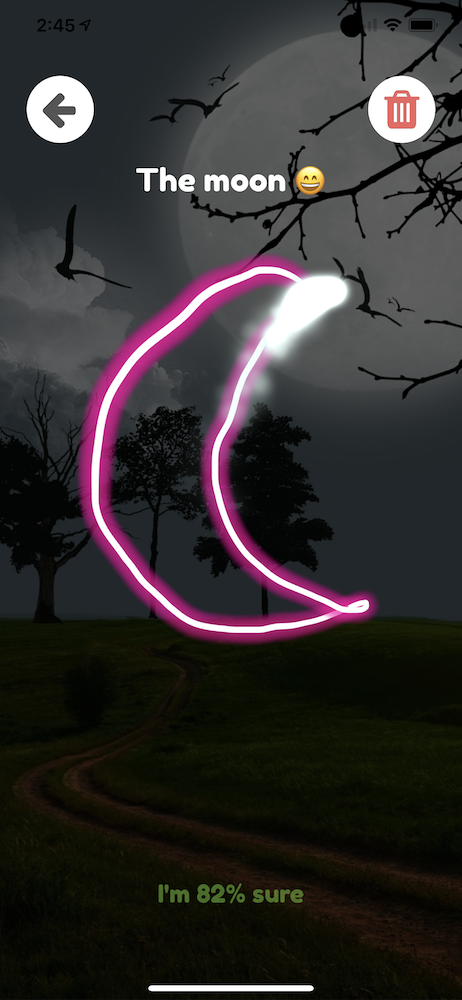
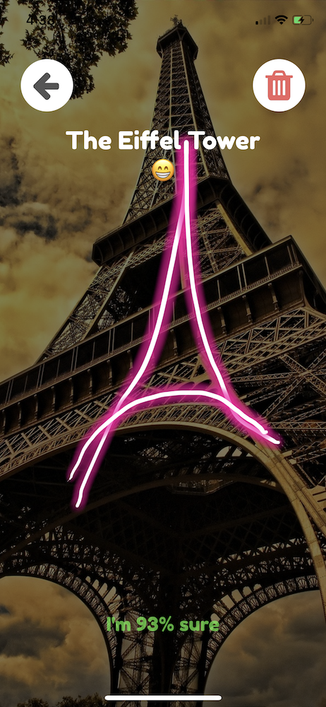

# NerdDoodle
Doodle something, and Nerd Doodle uses CoreML to identify it. It displays its level of confidence, and performs an image search for the top result.

Adopted from [Guess My Drawing](https://github.com/hetelek/GuessMyDrawing-ios)

Based on Google Quick Draw. 

# Requirements
* Nerd Doodle must be run on hardware (i.e. simulator is not currently supported)
* A Pixabay API key if you wish to use image search. Just edit `PixabayService.swift` with your key.

# Installation
* Open NerdDoodle.xcworkspace in XCode
* Run the NerdDoodle scheme

(Note: it's not necessary to install dependencies -- they are checked in)

# Screenshots

